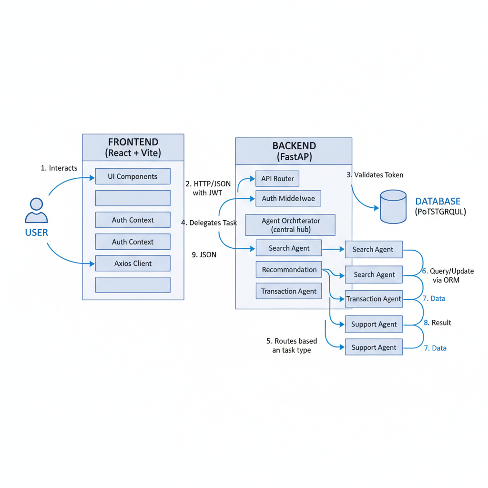
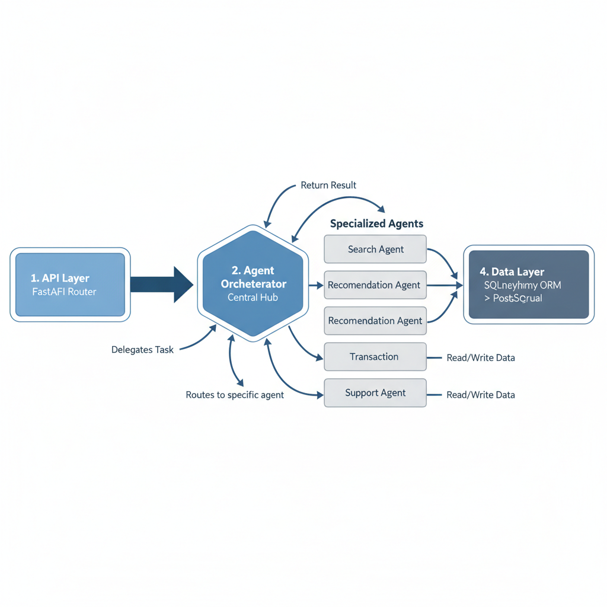

# Dataset Marketplace Architecture

## System Overview

The Dataset Marketplace is a modern web application built using a decoupled client-server architecture. It consists of a React-based frontend for the user interface and a FastAPI-based backend for business logic and data management, backed by a PostgreSQL database.

**End-to-End Request Flow:**
1. User interacts with the Frontend UI
2. Frontend sends HTTP/JSON request with JWT token to Backend API
3. API Router validates JWT via Auth Middleware
4. Authenticated request delegated to Agent Orchestrator
5. Orchestrator routes to appropriate specialized agent (Search, Recommendation, Transaction, or Support)
6. Agent queries/updates Database via SQLAlchemy ORM
7. Database returns data to Agent
8. Agent processes data and returns result to Orchestrator
9. Orchestrator sends response back through API
10. Frontend receives JSON response and updates UI for User

## Component Details

### 1. Frontend (`/frontend`)
Built with **React 18** and **Vite**, styled with **Tailwind CSS**.

*   **Core Technologies**:
    *   `React`: UI library.
    *   `React Router`: Client-side routing.
    *   `Axios`: HTTP client for API requests.
    *   `Tailwind CSS`: Utility-first styling (supports Dark Mode).
*   **Key Structure**:
    *   `src/context/AuthContext.jsx`: Manages global authentication state (User, Token) and handles login/logout logic.
    *   `src/pages/`: Top-level page components (Home, Search, Login, MyPurchases).
    *   `src/components/`: Reusable UI components (Navbar, DatasetCard, ThemeToggle).

### 2. Backend (`/backend`)
Built with **FastAPI** (Python 3.11).

*   **Core Technologies**:
    *   `FastAPI`: High-performance web framework.
    *   `SQLAlchemy`: ORM for database interactions.
    *   `Pydantic`: Data validation and schema definition.
    *   `Authlib` & `Python-Jose`: Authentication (OAuth2 & JWT).
*   **Key Structure**:
    *   `app/main.py`: Application entry point, middleware configuration.
    *   `app/api/`: Route handlers grouped by feature (`auth.py`, `datasets.py`, `purchases.py`).
    *   `app/models/`: SQLAlchemy database models.
    *   `app/core/`: Configuration and security utilities (`config.py`, `security.py`).

### 3. Database
*   **PostgreSQL**: Relational database storing Users, Datasets, and Purchases.
*   **Schema**:
    *   `users`: Stores user profiles, credentials (hashed), and balances.
    *   `datasets`: Stores dataset metadata (title, price, description).
    *   `purchases`: Links Users to Datasets they have bought.

## Key Workflows

### Authentication Flow
The application supports both **Local (Email/Password)** and **Google OAuth** authentication.

1.  **Login Request**:
    *   *Local*: User submits credentials. Backend verifies hash and issues JWT.
    *   *Google*: User clicks "Sign in with Google". Backend redirects to Google. Google calls back to Backend. Backend creates/updates user and issues JWT.
2.  **Token Storage**: Frontend receives JWT and stores it in `localStorage`.
3.  **Authenticated Requests**: `AuthContext` attaches the JWT (Bearer Token) to the Authorization header of subsequent API requests.
4.  **Backend Verification**: `get_current_user` dependency validates the token on protected endpoints.

### Dataset Purchase Flow
1.  **User Action**: User clicks "Buy Now" on a dataset page.
2.  **API Call**: Frontend sends `POST /api/purchases/` with the dataset ID.
3.  **Validation**: Backend checks if User has sufficient balance and hasn't already purchased the item.
4.  **Transaction**:
    *   Deduct price from User's balance.
    *   Add record to `purchases` table.
    *   (Optional) Increment Seller's balance.
5.  **Response**: Success message returned. Frontend updates UI to show "Download" button.

### Dark Mode Implementation
*   **State**: Managed by `ThemeToggle` component using `localStorage` to persist preference (`theme: 'dark' | 'light'`).
*   **Application**: Toggles the `dark` class on the root `<html>` or `
` element.
*   **Styling**: Tailwind's `dark:` prefix applies specific styles when the dark class is present (e.g., `dark:bg-gray-900`).

## Multi-Agent System

The backend incorporates a multi-agent system to handle complex business logic and workflows. This is managed by an **Agent Orchestrator**.

### Backend Agent Flow

### Core Components

1.  **Agent Orchestrator** (`app/agents/agent_orchestrator.py`):
    *   Acts as the central hub for managing and executing agent tasks.
    *   Maintains a registry of available agents: `search`, `recommendation`, `transaction`, `support`.
    *   Supports executing single tasks or complex workflows (sequences of tasks where output of one becomes input of another).
    *   Routes incoming requests to the appropriate specialized agent based on the task type.

2.  **Specialized Agents**:
    *   **Recommendation Agent** (`recommendation_agent.py`): 
        *   Analyzes user purchase history to provide personalized dataset recommendations.
        *   Uses collaborative filtering logic based on categories and tags.
        *   Falls back to popular datasets when no purchase history exists.
    *   **Search Agent** (`search_agent.py`): 
        *   Handles complex search queries with filters (category, tags, price range).
        *   Performs full-text search across dataset titles and descriptions.
        *   Returns ranked results based on relevance.
    *   **Transaction Agent** (`transaction_agent.py`): 
        *   Manages the complete purchase flow.
        *   Validates user balance and prevents duplicate purchases.
        *   Handles atomic transactions (deduct buyer balance, credit seller, create purchase record).
    *   **Support Agent** (`support_agent.py`): 
        *   Handles user support inquiries and FAQs.
        *   Can escalate complex issues to human support.

### Request Flow Example (Recommendations)

1.  **API Request**: `GET /api/datasets/recommendations` (with JWT token)
2.  **Authentication**: `get_current_user` dependency validates JWT and extracts user info
3.  **Agent Orchestration**: API endpoint creates `AgentOrchestrator` instance
4.  **Task Delegation**: Orchestrator calls `execute("recommendation", {"db": db, "user_id": user.id})`
5.  **Agent Processing**: Recommendation Agent:
    *   Queries database for user's purchase history
    *   Identifies purchased categories and tags
    *   Finds similar datasets user hasn't purchased
    *   Ranks by rating and download count
6.  **Response**: Agent returns list of datasets to Orchestrator → API → Frontend

### Integration
*   API endpoints (e.g., in `api/datasets.py`, `api/purchases.py`) instantiate the `AgentOrchestrator` to delegate specific tasks to these agents, keeping the API layer thin and the business logic encapsulated within agents.
*   Each agent inherits from `BaseAgent` which provides logging and capability reporting.
*   Agents are stateless and can be easily tested in isolation.
